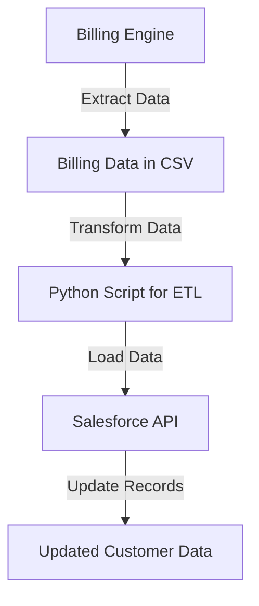

### Overview

In the competitive Australian energy market, retailers are constantly seeking ways to enhance operational efficiency. One such challenge involves ensuring accurate data synchronisation between internal billing systems and customer-facing platforms like Salesforce. For our client, an Australian energy retailer, this issue was critical. They faced delays and errors in synchronising data from their billing engine to Salesforce, which affected billing accuracy and customer satisfaction.

To resolve this, we implemented a robotic process automation (RPA) solution that automated the data synchronisation between the two systems, improving efficiency and reducing manual errors.

### The Challenge

The retailer used a legacy billing engine to calculate customer bills based on energy consumption. The billing data needed to be accurately reflected in Salesforce, where customer service representatives could access and review the information. 

Prior to automation, data synchronisation was performed manually, requiring a dedicated team to regularly export, transform, and import data. This process was not only slow, taking up to 24 hours for updates, but also prone to human error, leading to mismatches and delays in issuing customer bills. Moreover, the manual nature of the task created a backlog during peak times, such as when quarterly bills were generated.

### Process Automation Solution

Our approach was to build a robotic process automation (RPA) that could automate the entire data synchronisation workflow. The RPA would:
- Extract billing data from the legacy billing engine (export).
- Transform the data into the format required by Salesforce (ETL - Extract, Transform, Load).
- Import the transformed data into Salesforce, updating relevant customer records (import).

This solution was designed to run on a schedule, synchronising data every few hours, ensuring near-real-time accuracy.

Here’s a breakdown of the process:

1. **Data Extraction**: The RPA tool interacts with the billing engine’s API to pull relevant billing data in CSV format.
2. **Data Transformation**: A Python script processes the CSV data, ensuring it meets Salesforce’s import requirements, including proper field mapping and data cleaning.
3. **Salesforce Update**: Using Salesforce’s API, the RPA uploads the transformed data, updating or creating records as necessary.

### Diagram of Process Flow (in Mermaid code)



### Benefits of the Automation

This automated process brought significant advantages to the retailer, including:

1. **Time Savings**: The synchronisation process, which previously took up to 24 hours, was reduced to just 15 minutes, running every 4 hours throughout the day.
   
2. **Error Reduction**: By removing the manual component, human errors were eliminated. This resulted in a 95% reduction in billing errors, leading to fewer customer disputes.

3. **Improved Customer Experience**: Customer service teams had access to up-to-date billing data in Salesforce, improving response times and customer satisfaction.

4. **Operational Efficiency**: The automation freed up the team previously responsible for manual data entry, allowing them to focus on higher-value tasks. This resulted in a 25% reduction in operating costs related to billing administration.

5. **Scalability**: The process was designed to scale easily, meaning that as the retailer grows its customer base, the RPA can handle increased data volumes without performance degradation.

### Sample Code for the RPA Process

Here's an example of how the key components of the RPA were implemented:

#### 1. Data Extraction from Billing Engine
```python
import requests
import csv

# API credentials
billing_api_url = "https://api.billingengine.com/data"
api_key = "YOUR_API_KEY"

# Extract billing data
response = requests.get(billing_api_url, headers={"Authorization": f"Bearer {api_key}"})

# Save to CSV
with open('billing_data.csv', 'w') as file:
    writer = csv.writer(file)
    writer.writerows(response.json())
```

#### 2. Data Transformation (ETL)
```python
import pandas as pd

# Load CSV
data = pd.read_csv('billing_data.csv')

# Transform data for Salesforce
data['CustomerID'] = data['CustomerID'].astype(str)
data['AmountDue'] = data['AmountDue'].apply(lambda x: round(float(x), 2))

# Save transformed data
data.to_csv('transformed_data.csv', index=False)
```

#### 3. Uploading Data to Salesforce
```python
from simple_salesforce import Salesforce
import pandas as pd

# Salesforce credentials
sf = Salesforce(username='your_username', password='your_password', security_token='your_token')

# Load transformed data
data = pd.read_csv('transformed_data.csv')

# Prepare data for Salesforce
for index, row in data.iterrows():
    sf.Contact.update(row['CustomerID'], {
        'Amount_Due__c': row['AmountDue'],
        'Last_Bill_Date__c': row['LastBillDate'],
    })
```

### Conclusion

The automated data synchronisation process between the billing engine and Salesforce was a game-changer for this Australian energy retailer. The deployment of robotic process automation not only improved accuracy and timeliness of billing data but also reduced operational costs and improved customer satisfaction.

This case study is an excellent example of how automation can tackle specific pain points, yielding measurable benefits and creating a scalable, efficient process for business-critical operations.

By leveraging RPA and API integrations, businesses in the energy sector and beyond can optimise their workflows, reduce errors, and improve overall performance.

---

**Next Steps**: If your business is dealing with manual, time-consuming processes like this, automation could be the solution to streamline your operations. Feel free to reach out for a consultation!