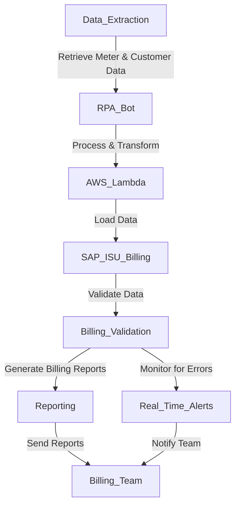

**Industry**: Energy Retail  
**Location**: Australia  
**Solution**: Automated Billing Engine Syncs  
**Tools**: Python, RPA (UiPath), SQL, AWS Lambda, Billing Software Integration (SAP IS-U)

---

### Introduction

In the energy retail industry, accurate and timely billing is essential for both revenue generation and customer satisfaction. Energy retailers rely on complex billing engines that process consumption data, apply tariffs, and generate invoices for customers. However, syncing data between various systems, such as metering platforms, customer databases, and billing engines, is often a manual and error-prone process.

This case study explores how an Australian energy retailer automated the synchronization of its billing engine, ensuring real-time data updates, improved billing accuracy, and reduced operational overhead.

---

### Problem

The energy retailer was experiencing several challenges with their manual billing engine sync process:

- **Manual data sync**: The team had to manually extract and load customer consumption data, tariffs, and meter readings into the billing engine, which was a time-consuming and tedious task.
- **Inconsistent billing cycles**: Delays in syncing data resulted in discrepancies in billing, leading to customer complaints about incorrect or delayed invoices.
- **High error rates**: Manually syncing large volumes of data from disparate systems increased the risk of errors, such as missing or inaccurate meter readings, which impacted the accuracy of bills.
- **Lack of scalability**: As the company’s customer base grew, the existing process could not scale efficiently, requiring more manual intervention and resources.

The company needed an automated solution to streamline the billing engine syncs, ensuring that all systems were updated in real-time without manual intervention.

---

### Solution: Automated Billing Engine Syncs

The retailer implemented an **automated billing engine sync process** using **Robotic Process Automation (RPA)** and **cloud-based services** to automate data extraction, transformation, and synchronization between their metering systems and **SAP IS-U** (their billing engine). This ensured that customer consumption data and meter readings were up-to-date, leading to more accurate billing.

#### Process Overview

Here’s a breakdown of the automated billing sync process:

1. **Data Extraction (SQL & API)**: The RPA bot extracts meter readings, customer consumption data, and tariffs from the metering system and customer database using **SQL queries** and **API calls**.
2. **Data Transformation (AWS Lambda)**: The extracted data is passed to an **AWS Lambda** function that processes and formats the data according to the requirements of the billing engine, ensuring that the data is clean and consistent.
3. **Data Loading (SAP IS-U)**: Once the data is validated, the bot uploads the transformed data into the **SAP IS-U billing engine**, where billing cycles are processed based on customer consumption.
4. **Billing Validation and Exception Handling**: The system automatically checks for any inconsistencies or errors in the billing data, flagging issues for manual review if necessary.
5. **Automated Report Generation**: After successful billing syncs, the bot generates a report summarising the synchronization status and any exceptions, which is shared with the billing team and stakeholders.
6. **Real-time Monitoring and Alerts**: The system monitors the sync process in real-time, triggering alerts in case of delays, errors, or discrepancies in data. This allows the team to act quickly, ensuring seamless billing operations.

#### Process Diagram

Below is a visual representation of the automated billing engine sync process:



### Sample Code

Below is an example of how the automation bot extracts meter readings and uploads them to the billing engine using Python, SQL, and AWS Lambda.

```python
import pyodbc
import boto3
import requests

# Step 1: Extract meter readings and customer data from the database
def fetch_meter_readings():
    conn = pyodbc.connect('DRIVER={SQL Server};SERVER=server_name;DATABASE=energy_db;UID=user;PWD=password')
    query = """
    SELECT customer_id, meter_id, meter_reading, reading_date
    FROM meter_readings
    WHERE reading_date = CONVERT(DATE, GETDATE())
    """
    data = pd.read_sql(query, conn)
    conn.close()
    return data

# Step 2: Transform data using AWS Lambda
def process_data_with_lambda(data):
    lambda_client = boto3.client('lambda')
    payload = data.to_json()
    response = lambda_client.invoke(
        FunctionName='process_billing_data',
        InvocationType='RequestResponse',
        Payload=payload
    )
    return response['Payload'].read()

# Step 3: Upload data to the SAP IS-U billing engine
def upload_to_billing_engine(transformed_data):
    billing_api_url = 'https://sap_billing_engine.com/api/upload'
    headers = {'Content-Type': 'application/json'}
    response = requests.post(billing_api_url, data=transformed_data, headers=headers)
    if response.status_code == 200:
        print("Billing data uploaded successfully")
    else:
        print("Failed to upload billing data")

# Main workflow
meter_data = fetch_meter_readings()
transformed_data = process_data_with_lambda(meter_data)
upload_to_billing_engine(transformed_data)
```

This script demonstrates the key steps in automating the billing engine sync, from extracting meter readings to transforming the data with AWS Lambda and uploading it to the billing engine.

### Benefits Derived

The automation of billing engine syncs provided several key benefits to the energy retailer:

1. **Improved Billing Accuracy**: Automating data extraction and transformation ensured that meter readings and customer data were synced accurately and in real-time, reducing billing errors and customer complaints.
2. **Faster Billing Cycles**: The automation reduced the time taken to process billing cycles by 60%, allowing the company to generate and send invoices more quickly.
3. **Scalability**: The automated solution scaled effortlessly as the customer base grew, ensuring that the sync process could handle larger volumes of data without additional resources.
4. **Operational Efficiency**: The need for manual data entry and syncing was eliminated, freeing up staff to focus on more strategic tasks, such as managing exceptions and optimising billing strategies.
5. **Proactive Error Management**: Real-time monitoring and alerts allowed the team to identify and resolve sync issues before they impacted the billing process, ensuring seamless operations.

---

### Conclusion

By automating the synchronization of its billing engine, the Australian energy retailer improved both billing accuracy and efficiency. The integration of RPA, cloud services like AWS Lambda, and a powerful billing engine (SAP IS-U) enabled the company to automate time-consuming manual processes, reduce operational costs, and provide a better customer experience.

For energy retailers, automating key processes like billing engine syncs can significantly enhance their ability to manage data flows, increase scalability, and ensure timely, accurate billing. This solution not only improves operational efficiency but also helps maintain customer trust through reliable and error-free billing practices.

---

This case study demonstrates the power of automation in complex billing environments. By automating billing engine syncs, energy retailers can reduce manual intervention, eliminate errors, and scale operations to meet growing customer demands—ensuring accurate billing and better customer service across the board.