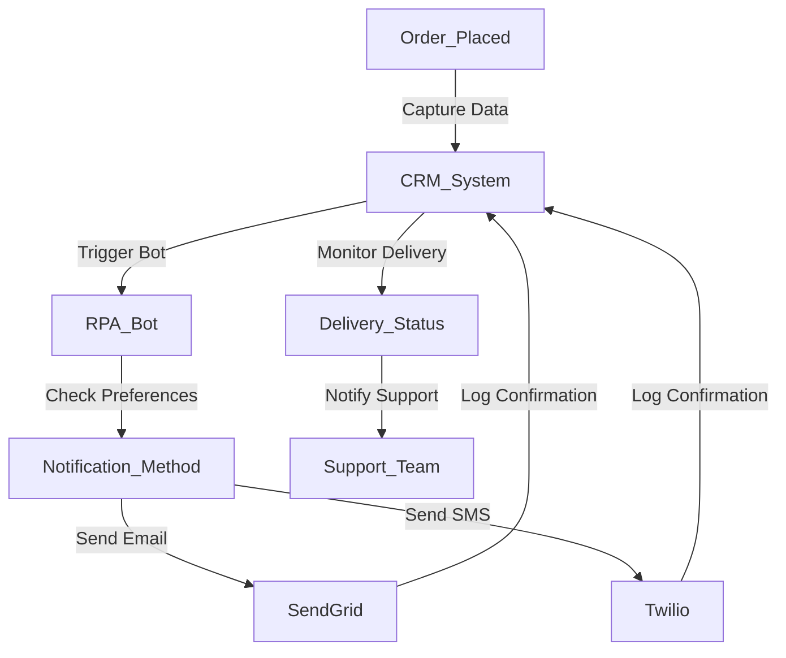

**Industry**: eCommerce  
**Location**: Australia  
**Solution**: Automated Order Confirmation via Email and SMS  
**Tools**: Python, RPA (UiPath), Twilio (SMS), SendGrid (Email), CRM Integration

---

### Introduction

In the fast-paced world of eCommerce, timely and accurate communication with customers is essential for a positive shopping experience. After placing an order, customers expect immediate confirmation of their purchase via email or SMS. However, manually sending order confirmations is not only inefficient but also prone to delays and errors.

In this case study, we explore how an Australian eCommerce company automated its order confirmation process, ensuring that customers receive instant updates about their purchases via email or SMS, while streamlining internal operations.

---

### Problem

The company was experiencing several challenges with its manual order confirmation process:

- **Time-consuming manual process**: The customer support team had to manually send email or SMS confirmations for every order, which became increasingly difficult as the business grew.
- **Delayed notifications**: Delays in sending confirmations led to customer dissatisfaction, as buyers were often left wondering whether their orders were processed successfully.
- **Prone to errors**: Manual processes resulted in occasional errors, such as incorrect order details being sent or confirmations not being sent at all.
- **Lack of scalability**: As the company expanded, the number of orders increased dramatically, making it impossible to keep up with customer communication using manual methods.

The company needed a scalable, automated solution to instantly send accurate order confirmations to customers.

---

### Solution: Automated Order Confirmation via Email and SMS

The company implemented an **automated order confirmation system** using **Robotic Process Automation (RPA)**, integrated with **Twilio** for SMS and **SendGrid** for email communication. This system automatically triggered notifications whenever an order was placed, ensuring customers received prompt confirmation with accurate details.

#### Process Overview

Here’s how the automated order confirmation process worked:

1. **Order Placement (Website/CRM)**: When a customer placed an order, the order details were captured by the company’s website and sent to the CRM system.
2. **Trigger RPA Bot**: The CRM triggered an RPA bot, which retrieved the necessary order details (e.g., order number, customer name, items purchased, total amount).
3. **Email Confirmation (SendGrid)**: If the customer had opted for email confirmation, the bot used **SendGrid** to send a templated email containing the order details.
4. **SMS Confirmation (Twilio)**: If the customer preferred SMS, the bot used **Twilio** to send a personalised message with the order details to their phone.
5. **Error Handling**: The bot included built-in error-checking mechanisms to ensure that all required fields (e.g., email address or phone number) were present and accurate before sending the confirmation. If an error was detected, the system flagged it for manual review.
6. **Real-Time Updates**: The system logged all communications in the CRM for future reference, allowing the customer support team to track which confirmations were sent and received in real-time.
7. **Notification Monitoring**: The system monitored for successful delivery of emails and SMS messages, notifying the support team if any confirmation failed to send.

#### Process Diagram

Here’s a visual representation of the automated order confirmation process:



### Sample Code

Here’s a Python code snippet that demonstrates how the system sends an automated email confirmation using **SendGrid** and SMS confirmation using **Twilio**.

#### Email Confirmation (SendGrid)

```python
import sendgrid
from sendgrid.helpers.mail import Mail

def send_email_confirmation(order_details):
    sg = sendgrid.SendGridAPIClient(api_key='YOUR_SENDGRID_API_KEY')
    message = Mail(
        from_email='orders@ecommerce.com',
        to_emails=order_details['customer_email'],
        subject='Your Order Confirmation',
        html_content=f"""
        <p>Dear {order_details['customer_name']},</p>
        <p>Thank you for your order! Here are your order details:</p>
        <ul>
            <li>Order Number: {order_details['order_number']}</li>
            <li>Total Amount: ${order_details['total_amount']}</li>
        </ul>
        <p>We will notify you when your order ships.</p>
        <p>Best regards,<br>The eCommerce Team</p>
        """
    )
    response = sg.send(message)
    return response.status_code
```

#### SMS Confirmation (Twilio)

```python
from twilio.rest import Client

def send_sms_confirmation(order_details):
    client = Client("YOUR_TWILIO_ACCOUNT_SID", "YOUR_TWILIO_AUTH_TOKEN")
    message = client.messages.create(
        body=f"Hi {order_details['customer_name']}, your order {order_details['order_number']} has been received. Total: ${order_details['total_amount']}. Thank you!",
        from_='+1234567890',  # Your Twilio phone number
        to=order_details['customer_phone']
    )
    return message.sid
```

This script demonstrates how the bot sends both email and SMS confirmations, based on customer preferences, using SendGrid and Twilio’s APIs.

### Benefits Derived

The automated order confirmation system provided several key benefits to the company:

1. **Instant Communication**: Customers received immediate confirmation of their orders via their preferred communication method, improving the overall shopping experience.
2. **Increased Accuracy**: The automation reduced human error, ensuring that all order details were correct and that confirmations were sent promptly.
3. **Scalability**: The system easily scaled to handle hundreds or even thousands of orders per day, making it suitable for peak sales periods such as Black Friday or holiday shopping.
4. **Reduced Workload**: By automating the confirmation process, the customer support team could focus on more complex customer inquiries rather than spending time manually sending emails and SMS messages.
5. **Improved Customer Satisfaction**: Fast, accurate order confirmations led to fewer inquiries from customers wondering if their orders had been received, resulting in improved customer satisfaction and fewer calls to the support centre.

---

### Conclusion

By automating the order confirmation process, the Australian eCommerce company improved its operational efficiency and enhanced the customer experience. The system ensured that customers received timely, accurate information about their orders, whether via email or SMS, reducing errors and delays.

For eCommerce businesses looking to improve communication with their customers, automating order confirmations is a simple yet highly effective way to enhance customer satisfaction and streamline internal workflows. This case study demonstrates how technology can be leveraged to deliver better, faster service while reducing the burden on customer support teams.

---

This case study showcases the benefits of automation in customer communication. Automating order confirmations via email and SMS not only improves customer satisfaction but also enhances operational efficiency, making it an essential solution for eCommerce businesses looking to scale.