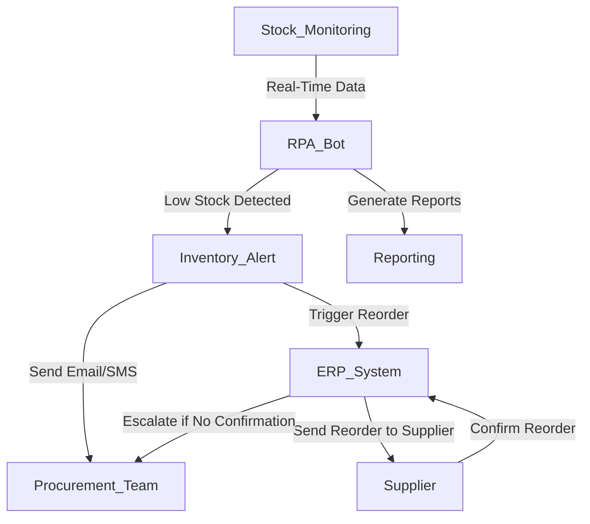

**Industry**: Retail  
**Location**: Australia  
**Solution**: Automated Inventory Level Alerts and Reordering  
**Tools**: Python, RPA (UiPath), Inventory Management System (IMS), ERP Integration, Email/SMS Alerts

---

### Introduction

Inventory management is a critical function in retail operations. Maintaining optimal stock levels ensures that businesses meet customer demand without overstocking or running out of essential items. However, manually monitoring inventory and triggering reorders is labour-intensive and prone to delays.

In this case study, we explore how an Australian retailer automated inventory level monitoring and implemented real-time alerts for low stock, automatically triggering reordering processes to ensure stock levels were maintained, reducing the risk of stockouts and improving supply chain efficiency.

---

### Problem

The retailer was experiencing several challenges with manual inventory monitoring and reordering:

- **Manual stock monitoring**: Staff had to regularly check inventory levels manually, leading to missed low-stock situations and delayed reorders.
- **Stockouts and missed sales**: Delays in detecting low stock levels often resulted in stockouts, causing missed sales opportunities and disappointed customers.
- **Overstocking**: In some cases, reorders were placed too late or inaccurately, resulting in overstocking of certain items, tying up capital in excess inventory.
- **Lack of real-time data**: The existing system didn’t provide real-time visibility into stock levels, making it hard for the procurement team to respond promptly.
- **Scaling issues**: As the retailer expanded and added more SKUs (Stock Keeping Units), the manual process became unsustainable, leading to increased errors and inefficiency.

The company needed a scalable, automated solution to monitor inventory levels, alert the procurement team when stock ran low, and trigger reorders from suppliers without manual intervention.

---

### Solution: Automated Inventory Level Alerts and Reordering

The retailer implemented an **automated inventory alert system** using **Robotic Process Automation (RPA)** to monitor stock levels in real-time, trigger low-stock alerts, and automatically place reorders through their **ERP system**. The integration of inventory management tools with email and SMS notification services ensured prompt action when stock levels approached critical thresholds.

#### Process Overview

Here’s how the automated inventory level alert and reordering process worked:

1. **Real-Time Inventory Monitoring (IMS)**: The RPA bot continuously monitors stock levels in the retailer’s **Inventory Management System (IMS)** and compares them against predefined reorder thresholds.
2. **Low-Stock Detection**: When stock levels for any product fall below the minimum threshold, the bot triggers a low-stock alert.
3. **Automated Alerts (Email/SMS)**: The bot sends an alert via **email** or **SMS** to the procurement team, containing product details, current stock levels, and supplier information.
4. **Reorder Trigger**: For critical items, the bot automatically triggers a reorder by sending a purchase request to the supplier through the retailer’s **ERP system**.
5. **Supplier Confirmation**: The bot tracks the status of the reorder, ensuring that a confirmation is received from the supplier. If no confirmation is received within a predefined period, the bot escalates the issue to the procurement team.
6. **Reporting and Analytics**: The system generates weekly reports summarising stock alerts, reorders, and inventory trends, helping the procurement team optimise future stock management decisions.

#### Process Diagram

Below is a visual representation of the automated inventory level alert and reordering process:



### Sample Code

Here’s a simplified Python code snippet demonstrating how the bot monitors inventory levels, sends low-stock alerts via email, and triggers reordering through the ERP system.

#### Low-Stock Alert (Email)

```python
import smtplib
from email.mime.text import MIMEText

def send_low_stock_alert(product_name, stock_level, supplier_email):
    msg = MIMEText(f"The stock level for {product_name} is critically low: {stock_level} units remaining. Please reorder from the supplier.")
    msg['Subject'] = f"Low Stock Alert: {product_name}"
    msg['From'] = 'inventory@retailer.com'
    msg['To'] = supplier_email

    with smtplib.SMTP('smtp.mailserver.com') as server:
        server.login('username', 'password')
        server.send_message(msg)
    print(f"Low stock alert for {product_name} sent to {supplier_email}")

# Example usage
send_low_stock_alert('Product XYZ', 5, 'supplier@example.com')
```

#### Automated Reorder (ERP Integration)

```python
import requests

def trigger_reorder(product_id, supplier_id, quantity):
    # API endpoint for ERP system reorder
    api_url = 'https://erp_system.com/api/reorder'
    order_data = {
        'product_id': product_id,
        'supplier_id': supplier_id,
        'quantity': quantity
    }

    response = requests.post(api_url, json=order_data)
    
    if response.status_code == 200:
        print(f"Reorder placed successfully for product ID {product_id}")
    else:
        print(f"Failed to place reorder for product ID {product_id}")

# Example usage
trigger_reorder(101, 202, 50)  # Reorder 50 units of product 101 from supplier 202
```

This code demonstrates how the system sends low-stock alerts via email and automatically triggers reordering through the ERP system.

### Benefits Derived

The implementation of automated inventory level alerts and reordering provided several key benefits to the retailer:

1. **Reduced Stockouts**: The automation ensured that low-stock alerts were triggered in real-time, preventing stockouts and ensuring that popular products were always available for customers.
2. **Improved Efficiency**: The manual effort required to monitor stock levels and place reorders was eliminated, freeing up staff to focus on higher-value tasks such as supplier negotiation and demand forecasting.
3. **Faster Reordering**: The system’s ability to trigger automatic reorders for critical items reduced delays in the supply chain, ensuring that stock levels were replenished quickly.
4. **Better Inventory Control**: Automated alerts and real-time monitoring helped the procurement team maintain optimal inventory levels, avoiding overstocking and reducing carrying costs.
5. **Scalability**: As the retailer expanded and added new products, the system scaled effortlessly to manage a larger number of SKUs, ensuring that inventory management remained efficient.

---

### Conclusion

By automating inventory level alerts and reordering, the Australian retailer improved its inventory management process, reducing stockouts and overstocking while increasing operational efficiency. The integration of RPA with their inventory and ERP systems allowed the company to respond to real-time changes in stock levels, ensuring that reorders were placed without delay.

For retailers looking to optimise their inventory management, automating low-stock alerts and reordering is a highly effective way to reduce human error, improve customer satisfaction, and streamline the supply chain.

---

This case study demonstrates the value of automation in inventory management. By implementing automated inventory level alerts and reordering, businesses can improve stock availability, reduce costs, and scale operations efficiently, ultimately enhancing the customer experience and driving business success.