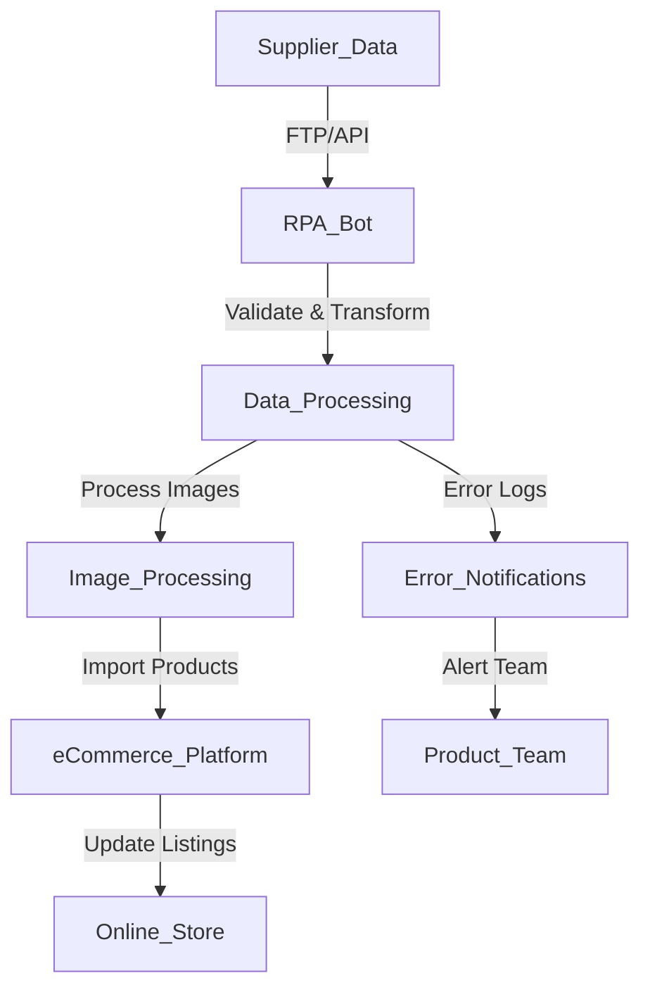

**Industry**: eCommerce  
**Location**: Australia  
**Solution**: Automated Product Importing from Suppliers  
**Tools**: Python, RPA (UiPath), FTP/SFTP, REST API, CSV, Image Processing, eCommerce Platform Integration (Shopify, WooCommerce)

---

### Introduction

In eCommerce, having an up-to-date product catalogue is crucial for sales and customer satisfaction. However, manually importing product details, images, and specifications from suppliers can be a time-consuming, error-prone task, especially when dealing with large product catalogues or frequent updates. This process becomes even more complex when multiple suppliers are involved, each providing data in different formats.

In this case study, we explore how an Australian eCommerce business automated the process of importing product details and images from suppliers, ensuring that their online store remained current without the need for manual intervention.

---

### Problem

The business faced several challenges with manual product importing:

- **Time-consuming product updates**: Each time a supplier introduced new products or updated existing ones, staff had to manually import product details (descriptions, SKUs, prices) and images into the eCommerce platform, which was inefficient.
- **Inconsistent data formats**: Suppliers provided product data in different formats (CSV, XML, JSON), making it difficult to standardise and import the data quickly.
- **Frequent errors**: Manual data entry resulted in occasional mistakes, such as incorrect product specifications, pricing errors, or missing images, which affected the customer experience.
- **Scaling difficulties**: As the number of products and suppliers grew, the manual process became increasingly unsustainable, leading to delays in adding new products to the platform.
- **Outdated catalogues**: Without an automated system, the product catalogue was often out of sync with supplier updates, leading to potential sales of out-of-stock or discontinued items.

To address these challenges, the company needed an automated solution that could regularly pull product data and images from suppliers and update their eCommerce platform efficiently.

---

### Solution: Automated Product Importing

The business implemented an **automated product importing solution** using **Robotic Process Automation (RPA)** and **APIs** to extract product data from suppliers, process it, and upload it to their eCommerce platform (Shopify). This automation streamlined the import process, reduced human errors, and ensured that product information was always up-to-date.

#### Process Overview

Here’s a breakdown of the automated product importing process:

1. **Data Retrieval from Suppliers (FTP/API)**: The RPA bot regularly retrieves product details and images from suppliers via **FTP/SFTP** servers or supplier **APIs**. Suppliers provide data in formats such as CSV, XML, or JSON.
2. **Data Transformation and Validation**: The bot processes the data, standardising it to match the format required by the eCommerce platform. This includes validating fields (e.g., SKU, price, availability) and checking for missing or erroneous information.
3. **Image Processing**: Product images are downloaded, checked for quality (resolution, size), and resized or compressed as necessary to meet the platform’s requirements.
4. **Import to eCommerce Platform**: The bot uses the platform’s **API (Shopify/WooCommerce)** to automatically import the product details and images, adding new products or updating existing listings.
5. **Error Handling**: The bot logs any errors (e.g., missing fields, failed uploads) and sends notifications to the product management team for manual review if needed.
6. **Scheduled Updates**: The system is scheduled to run at regular intervals (e.g., daily or weekly) to ensure the product catalogue is always up-to-date with the latest information from suppliers.

#### Process Diagram

Below is a visual representation of the automated product importing process:



### Sample Code

Here’s a simplified Python code snippet that demonstrates how the bot retrieves product data from a supplier’s FTP server, processes it, and uploads it to an eCommerce platform using an API (Shopify in this example).

#### FTP Data Retrieval and CSV Processing

```python
import ftplib
import csv
import requests

# Step 1: Connect to FTP server and download product data
def download_product_data():
    ftp = ftplib.FTP('ftp.supplier.com')
    ftp.login(user='username', passwd='password')
    with open('products.csv', 'wb') as file:
        ftp.retrbinary('RETR product_data.csv', file.write)
    ftp.quit()

# Step 2: Process CSV data
def process_product_data(csv_file):
    products = []
    with open(csv_file, mode='r') as file:
        reader = csv.DictReader(file)
        for row in reader:
            product = {
                'title': row['Product Name'],
                'sku': row['SKU'],
                'price': row['Price'],
                'inventory_quantity': row['Stock'],
                'image_url': row['Image URL']
            }
            products.append(product)
    return products
```

#### Upload to Shopify API

```python
# Step 3: Upload products to Shopify
def upload_to_shopify(product_data):
    shopify_url = 'https://yourstore.myshopify.com/admin/api/2023-01/products.json'
    headers = {
        'Content-Type': 'application/json',
        'X-Shopify-Access-Token': 'YOUR_SHOPIFY_API_TOKEN'
    }
    
    for product in product_data:
        product_payload = {
            "product": {
                "title": product['title'],
                "variants": [{
                    "sku": product['sku'],
                    "price": product['price'],
                    "inventory_quantity": product['inventory_quantity']
                }],
                "images": [{
                    "src": product['image_url']
                }]
            }
        }
        
        response = requests.post(shopify_url, json=product_payload, headers=headers)
        if response.status_code == 201:
            print(f"Product {product['title']} uploaded successfully.")
        else:
            print(f"Failed to upload {product['title']}. Error: {response.text}")

# Main workflow
download_product_data()
products = process_product_data('products.csv')
upload_to_shopify(products)
```

This script demonstrates how the bot retrieves product data from an FTP server, processes the data, and imports it into Shopify using their API.

### Benefits Derived

The automated product importing solution provided several key benefits to the business:

1. **Time Savings**: The system significantly reduced the time spent manually importing product details and images, allowing the team to focus on other high-value tasks such as marketing and customer service.
2. **Increased Accuracy**: Automating the import process eliminated errors related to manual data entry, such as incorrect product descriptions, SKUs, and pricing.
3. **Real-Time Updates**: Product data was updated in real-time, ensuring that new products, discontinued items, or pricing changes were reflected on the website immediately, improving customer satisfaction.
4. **Scalability**: The automation handled a growing number of SKUs and suppliers effortlessly, allowing the business to scale without additional resource requirements.
5. **Enhanced Supplier Integration**: The system streamlined communication with multiple suppliers, automatically adapting to different data formats (CSV, XML, JSON), ensuring smooth and consistent product imports.

---

### Conclusion

By automating the product importing process, the Australian eCommerce business was able to keep its product catalogue up-to-date and accurate, all while significantly reducing the manual effort involved. The automation streamlined supplier integrations, eliminated data entry errors, and ensured that new products and updates were reflected on the online store in real-time.

For eCommerce businesses managing large and diverse product catalogues, automating the product import process can dramatically improve efficiency, reduce errors, and ensure that customers always have access to the latest product offerings.

---

This case study highlights the importance of automation in managing eCommerce operations. Automating product imports not only increases operational efficiency but also improves data accuracy, scalability, and the overall customer experience. By adopting such a solution, eCommerce businesses can focus on growth and customer satisfaction rather than manual administrative tasks.