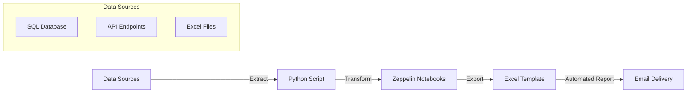

### Overview

In the world of telecommunications, managing vast amounts of data can be a logistical nightmare. Australian telcos deal with data from customer usage patterns, billing systems, network performance metrics, and more. One of the key challenges faced by a particular Australian telecommunications company was extracting this data from multiple sources and compiling it into comprehensive reports for internal stakeholders.

This case study details the process automation solution implemented for the telco, involving the use of Apache Zeppelin, Excel, and custom Python code for data extraction, transformation, and automated reporting. This automation not only saved time but also reduced human error and significantly improved the efficiency of data handling.

### Process Overview

The problem revolved around manually extracting data from various systems (databases, APIs, and Excel files), transforming it into a readable format, and compiling reports in Excel. This process was error-prone and time-consuming, often leading to delayed reporting and inaccuracies.

The solution implemented involved using Python scripts for automated data extraction, Zeppelin for data visualisation and manipulation, and Excel for the final reporting. The process was broken down into the following steps:

1. **Data Extraction**: Python scripts were used to extract data from multiple sources, including SQL databases and APIs.
2. **Data Transformation**: The extracted data was cleaned and transformed into the required structure using Zeppelin notebooks.
3. **Automated Reporting**: Once transformed, the data was exported into pre-configured Excel templates for reporting purposes.
4. **Scheduled Automation**: The entire process was automated to run on a daily/weekly schedule, delivering up-to-date reports directly to stakeholders' inboxes.

### Process Flow Diagram

To help visualise the entire workflow, here's a process flow diagram generated in Mermaid:



### Benefits of the Automation

Implementing this robotic process automation (RPA) had several tangible benefits for the telco:

1. **Time Savings**: The manual reporting process that used to take days was reduced to a matter of hours, or even minutes. Reports were automatically generated at scheduled intervals without the need for manual intervention.
  
2. **Reduced Errors**: Manual data extraction and reporting were prone to errors, especially when dealing with large datasets from multiple sources. Automation eliminated data entry mistakes, ensuring more accurate and consistent reports.

3. **Increased Efficiency**: By automating the extraction, transformation, and reporting steps, the team was able to focus on data analysis and decision-making rather than mundane administrative tasks.

4. **Scalability**: The solution was built to scale with growing data and reporting requirements. As the telco expanded its services, the automated system could handle more data and generate more complex reports with minimal changes to the underlying code.

5. **Real-time Insights**: With automated daily reporting, decision-makers received near real-time insights into key metrics such as network performance and customer behaviour.

### Sample Code

Below is an example of the Python code used for data extraction and transformation. The code connects to a SQL database, fetches the necessary data, processes it in a Zeppelin notebook, and exports it into an Excel report.

#### 1. **Python Script for Data Extraction**:
```python
import pandas as pd
import pyodbc

# Database connection
conn = pyodbc.connect('DRIVER={SQL Server};'
                      'SERVER=your_server;'
                      'DATABASE=your_database;'
                      'UID=your_username;'
                      'PWD=your_password')

# SQL query to fetch data
query = """
SELECT
    CustomerID,
    Usage,
    NetworkQuality,
    BillingAmount
FROM
    dbo.CustomerData
WHERE
    Date >= GETDATE() - 7
"""

# Execute query and fetch data
data = pd.read_sql(query, conn)

# Close the connection
conn.close()

# Save data to CSV for further processing
data.to_csv('customer_data.csv', index=False)
```

#### 2. **Zeppelin Notebook for Data Transformation**:
```python
%pyspark
from pyspark.sql import SparkSession
from pyspark.sql.functions import col

# Initialize Spark session
spark = SparkSession.builder.appName("Data Transformation").getOrCreate()

# Load the data
df = spark.read.option("header", True).csv("/path/to/customer_data.csv")

# Data cleaning and transformation
cleaned_df = df.filter(col("Usage").isNotNull()).withColumn("Usage_in_GB", col("Usage") / 1024)

# Save the transformed data for reporting
cleaned_df.write.mode("overwrite").csv("/path/to/transformed_data.csv")
```

#### 3. **Excel Automation for Reporting**:
The final part involved automating Excel reporting using the Python `openpyxl` library. Here's a snippet of how it was done:

```python
import openpyxl
from openpyxl import load_workbook

# Load Excel template
wb = load_workbook('report_template.xlsx')
ws = wb.active

# Load the transformed data
transformed_data = pd.read_csv('transformed_data.csv')

# Populate the Excel sheet with data
for index, row in transformed_data.iterrows():
    ws.append([row['CustomerID'], row['Usage_in_GB'], row['NetworkQuality'], row['BillingAmount']])

# Save the updated report
wb.save('final_report.xlsx')
```

### Conclusion

This automated process for data extraction and reporting not only streamlined operations for the Australian telco but also delivered timely and accurate reports without the need for manual intervention. The combination of Python, Zeppelin, and Excel created a robust, scalable solution that drastically reduced the time spent on repetitive tasks, improved data accuracy, and empowered the team to focus on strategic decision-making. 

This case study demonstrates the power of automation in improving operational efficiency, particularly in industries dealing with large and complex datasets.

--- 

That's how we did it! With the right tools and a little bit of coding, even the most tedious tasks can be transformed into an efficient, hands-off process. If you're working in an industry where data management and reporting are key, it might be time to consider a similar automation approach. Cheers to productivity!