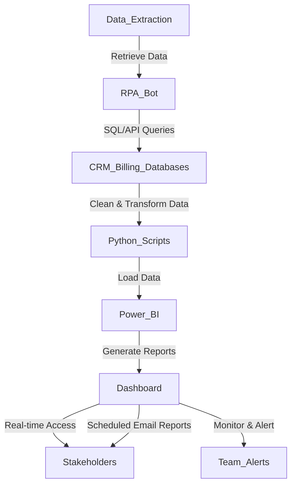

**Industry**: Telecommunications  
**Location**: Australia  
**Solution**: Automated Data Extraction and Reporting  
**Tools**: Python, RPA (UiPath), SQL, Power BI, Excel

---

### Introduction

The telecommunications (telco) industry operates in a highly data-driven environment. Telco companies rely on accurate, timely data to monitor network performance, customer usage, and sales metrics. However, manually extracting and processing this data for reporting can be tedious, error-prone, and time-consuming.

In this case study, we explore how an Australian telecommunications company automated its data extraction and reporting processes, allowing the organisation to reduce manual efforts, improve report accuracy, and deliver insights in near real-time.

---

### Problem

The telco company was facing several challenges in its data reporting processes:

- **Manual data extraction**: The team had to manually pull data from various systems, including CRM, billing, and network monitoring systems, into Excel spreadsheets for further analysis.
- **Error-prone**: Manually extracting and compiling data from multiple sources increased the risk of human error, leading to inaccurate reports and delayed decision-making.
- **Time-consuming reporting**: Preparing weekly and monthly reports took several days due to the manual nature of data collection, validation, and formatting.
- **Scalability issues**: As the company’s operations grew, so did the complexity and volume of data, making it increasingly difficult to manage reporting manually.

The company needed a streamlined, automated solution to improve efficiency, accuracy, and the timeliness of data reporting.

---

### Solution: Automated Data Extraction and Reporting

The solution implemented involved using **Robotic Process Automation (RPA)** to automate data extraction from multiple systems and **Business Intelligence (BI) tools** to generate and visualise reports. The automated workflow significantly reduced manual intervention, enhanced report accuracy, and enabled real-time reporting.

#### Process Overview

Here’s how the automated data extraction and reporting process worked:

1. **Data Extraction (RPA)**: The RPA bot retrieves data from various sources, including CRM (Salesforce), billing systems, and network performance databases, using **SQL** queries and API calls. The data is extracted at set intervals (e.g., daily or weekly).
2. **Data Transformation**: Extracted data is cleaned, validated, and formatted to ensure consistency. This is done using Python scripts that remove duplicates, correct formatting issues, and validate field entries.
3. **Data Loading (Power BI)**: The cleaned data is automatically loaded into the company’s **Power BI** system, where predefined dashboards and reports are generated based on key performance metrics (KPIs) such as customer churn, average revenue per user (ARPU), and network uptime.
4. **Report Generation**: Power BI generates reports in real-time, making them available to management and other stakeholders through a shared dashboard. These reports include visualisations such as charts, graphs, and tables.
5. **Automated Distribution**: Once the reports are generated, they are automatically emailed to relevant stakeholders, including executives and department heads, at scheduled intervals.
6. **Ongoing Monitoring**: The system continuously monitors data sources and sends alerts in case of anomalies, such as significant drops in network performance or spikes in customer complaints, enabling quicker response times.

#### Process Diagram

Here’s a visual representation of the automated data extraction and reporting process:



### Sample Code

Here’s a Python code snippet that demonstrates how the bot can extract data from an SQL database, clean it, and load it into Power BI for reporting:

```python
import pyodbc
import pandas as pd

# Step 1: Connect to the SQL database and retrieve data
def fetch_data_from_sql(query):
    conn = pyodbc.connect('DRIVER={SQL Server};SERVER=server_name;DATABASE=database_name;UID=user;PWD=password')
    data = pd.read_sql(query, conn)
    conn.close()
    return data

# Example SQL query
sql_query = """
SELECT customer_id, plan_type, monthly_usage, monthly_revenue
FROM billing_data
WHERE billing_month = '2024-09'
"""

# Fetch data from the billing database
data = fetch_data_from_sql(sql_query)

# Step 2: Clean and validate the data
def clean_data(df):
    # Remove duplicates
    df = df.drop_duplicates()
    
    # Validate monthly usage and revenue fields
    df = df[df['monthly_usage'] > 0]  # Ensure usage is positive
    df = df[df['monthly_revenue'] > 0]  # Ensure revenue is positive
    
    # Correct any formatting issues
    df['customer_id'] = df['customer_id'].astype(str)
    
    return df

cleaned_data = clean_data(data)

# Step 3: Export cleaned data to Excel (as an example)
cleaned_data.to_excel('cleaned_billing_data.xlsx', index=False)

# Step 4: Load the cleaned data into Power BI (Power BI integration through API or connector)
```

This script connects to the company’s SQL database, retrieves data, cleans and validates it, and prepares it for further analysis or loading into Power BI.

### Benefits Derived

The automation of data extraction and reporting provided several key benefits to the telco:

1. **Time Savings**: The manual process that once took several days was reduced to a matter of hours, with reports being generated and distributed automatically.
2. **Improved Accuracy**: Automating data extraction and validation eliminated manual data entry errors, leading to more accurate and reliable reports.
3. **Real-time Reporting**: With data being extracted and updated in near real-time, the company gained access to up-to-date insights on network performance, customer metrics, and sales trends.
4. **Increased Efficiency**: Automating repetitive tasks freed up staff to focus on higher-value activities, such as analysing trends and making strategic decisions based on the data.
5. **Better Decision-Making**: Management had access to more frequent and accurate reports, enabling quicker responses to issues such as network outages or customer churn spikes.

---

### Conclusion

By automating its data extraction and reporting processes, the Australian telco improved its ability to monitor key metrics and generate accurate, timely reports. The combination of RPA and business intelligence tools enabled real-time insights and a significant reduction in manual work, allowing the company to operate more efficiently and make faster, data-driven decisions.

For companies in data-heavy industries like telecommunications, automating the data extraction and reporting process not only improves operational efficiency but also enhances the ability to respond to challenges in a timely manner.

---

This case study demonstrates the power of automation in transforming data management workflows. For organisations that rely on vast amounts of data, automating the extraction, validation, and reporting processes can significantly improve operational efficiency, enhance decision-making, and provide a competitive edge.