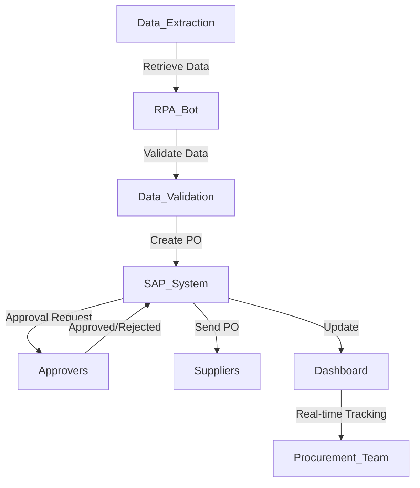

**Industry**: Manufacturing  
**Location**: Australia  
**Solution**: Automated Purchase Order (PO) Generation  
**Tools**: Python, RPA (UiPath), ERP Integration (SAP), Excel

---

### Introduction

Efficient procurement is crucial for manufacturing companies, especially when they handle a large volume of suppliers and purchase orders (POs). In this case study, we explore how a mid-sized Australian manufacturing company automated its PO generation process to reduce manual workload, eliminate errors, and speed up procurement workflows.

---

### Problem

The manufacturing company was facing several challenges in their PO generation process:

- **Manual PO creation**: The procurement team was manually creating hundreds of POs each month using data from multiple sources, which was time-consuming and prone to errors.
- **Delayed approvals**: POs required multiple levels of approval, and delays at any stage often held up critical supply orders, impacting production schedules.
- **Data entry mistakes**: Human errors, such as incorrect item numbers or quantities, often led to order discrepancies, resulting in delayed deliveries or overstocking.
- **Difficulty in tracking status**: It was hard for the team to track the status of POs in real-time, leading to communication gaps with suppliers.

To address these issues, the company needed a way to streamline the process, ensure accuracy, and reduce delays.

---

### Solution: Automated Purchase Order (PO) Generation

The solution implemented was an **automated Purchase Order generation process** using **Robotic Process Automation (RPA)**, which integrated with the company’s **ERP system (SAP)**. The RPA bot automated the entire PO process, from data extraction to order creation, reducing the manual workload by more than 70%.

#### Process Overview

Here’s how the automated PO generation process worked:

1. **Data Extraction (Excel)**: The RPA bot retrieves relevant purchase requisition data from an Excel sheet (populated by internal departments or the ERP system).
2. **Data Validation**: The bot verifies the data for completeness and accuracy, checking for missing fields, incorrect quantities, or invalid supplier codes.
3. **PO Creation (ERP System)**: Using the validated data, the RPA bot logs into the company’s SAP system and creates purchase orders based on predefined templates.
4. **Approval Workflow**: The bot triggers an approval workflow, sending the POs to the designated approvers for digital sign-off.
5. **PO Distribution**: Once approved, the POs are automatically emailed to suppliers, along with any required documentation.
6. **Tracking and Reporting**: The bot updates a shared dashboard with the status of each PO, providing real-time tracking for the procurement team and management.

#### Process Diagram

Here’s a visual representation of the automated PO generation process:



### Sample Code

Here’s a simplified example of how the RPA bot handles PO creation in SAP using Python and a mock SAP interface (real integration would depend on APIs provided by the ERP system or a middleware like UiPath):

```python
import openpyxl
from sap_integration import SAPClient

# Load the Excel file with purchase requisition data
wb = openpyxl.load_workbook('purchase_requisitions.xlsx')
sheet = wb.active

# Initialize SAP Client
sap_client = SAPClient(username='your_username', password='your_password')

# Loop through each row in the Excel file
for row in sheet.iter_rows(min_row=2, values_only=True):
    supplier_code, item_code, quantity, price = row
    
    # Validate data
    if not all([supplier_code, item_code, quantity, price]):
        print(f"Missing data for requisition: {row}")
        continue

    # Create PO in SAP
    po_number = sap_client.create_po(supplier_code, item_code, quantity, price)
    
    # If successful, update the Excel sheet
    if po_number:
        sheet[f'F{row[0]}'] = po_number
        print(f"PO {po_number} created successfully for {item_code}")
    else:
        print(f"Failed to create PO for {item_code}")

# Save the updated Excel file
wb.save('purchase_requisitions_updated.xlsx')
```

This script demonstrates how the bot extracts data from Excel, validates it, and interacts with a mock SAP system to create a purchase order.

### Benefits Derived

The automation of the PO generation process provided several key benefits to the company:

1. **Time Savings**: Automating the data extraction, validation, and PO creation processes reduced the manual workload by 70%, allowing the procurement team to focus on more strategic tasks.
2. **Error Reduction**: By eliminating manual data entry, the company saw a significant reduction in data entry errors, leading to fewer order discrepancies and smoother supplier relationships.
3. **Faster Approvals**: The automated workflow ensured that POs were immediately sent for approval, reducing the delays that previously impacted production schedules.
4. **Increased Productivity**: The procurement team’s output increased as the bot could generate and process POs 24/7, even outside of business hours.
5. **Improved Visibility**: Real-time tracking of PO status through the dashboard allowed for better communication with suppliers and internal teams, improving overall supply chain transparency.

---

### Conclusion

The automation of the Purchase Order generation process revolutionised the company’s procurement operations. By automating data collection, PO creation, and approval workflows, the company significantly reduced the time and errors associated with manual processes, improving overall productivity.

With an integrated RPA solution, the company was able to future-proof its procurement operations, ensuring scalability as the business grew. For organisations handling large volumes of POs, automating this process is a highly effective way to reduce operational bottlenecks, streamline approvals, and enhance supply chain efficiency.

---

This case study highlights the transformative impact of automation in procurement. By leveraging RPA, companies can ensure accuracy, speed, and transparency in their purchase order processes—paving the way for smoother operations and better supplier relationships.