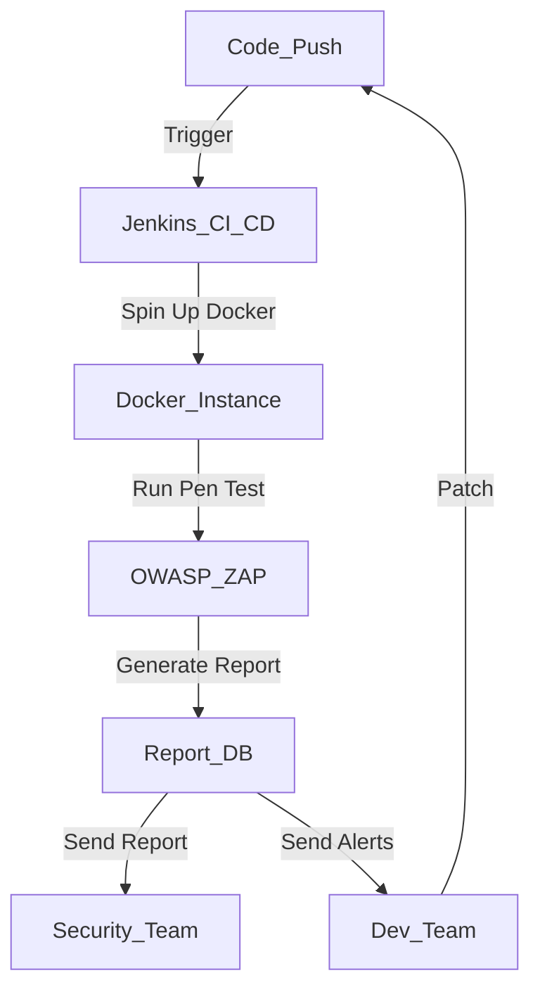

**Industry**: eCommerce  
**Location**: Australia  
**Solution**: Automated Penetration Testing  
**Tools**: Python, Selenium, OWASP ZAP, Jenkins, Docker

---

### Introduction

In the highly competitive eCommerce space, website security is paramount. Cyber threats are evolving at an alarming pace, and it's crucial for online retailers to stay ahead by regularly performing penetration tests. However, manual penetration testing is not only time-consuming but also prone to human error, making it an ideal candidate for automation.

In this case study, we explore how a mid-sized Australian eCommerce company implemented an automated penetration testing (pen-testing) solution, improving both their security posture and operational efficiency.

---

### Problem

The company was facing several challenges in conducting regular penetration tests on its platform. The major issues were:

- **Time-intensive manual testing**: The cybersecurity team had to schedule and manually conduct pen tests after each significant code deployment.
- **Inconsistent results**: With human testers, the results varied depending on who ran the test, which led to potential gaps in security coverage.
- **Scaling issues**: As the company’s user base grew, so did its infrastructure, and scaling manual pen testing to cover everything became impossible.

They needed a solution that could integrate with their CI/CD pipeline, trigger after each deployment, and provide reliable, comprehensive security results.

---

### Solution: Automated Penetration Testing

The solution implemented used an **automated robotic process automation (RPA)** for penetration testing by leveraging tools like **OWASP ZAP**, **Python scripting**, and **Jenkins** for integration within the company’s deployment pipeline.

#### Process Overview

Here’s a breakdown of the automation steps:

1. **Continuous Deployment Pipeline (Jenkins)**: After each code push, Jenkins triggers the testing phase.
2. **Spin Up Test Environment (Docker)**: A fresh instance of the eCommerce website is spun up in Docker to isolate testing.
3. **Automated Scanning (OWASP ZAP)**: Once the instance is live, an OWASP ZAP script runs automatically, simulating various types of attacks, including SQL injections, cross-site scripting (XSS), and more.
4. **Data Collection and Reporting**: Test results, vulnerabilities, and logs are captured by ZAP and fed into a database. Reports are auto-generated and shared with the security and development teams.
5. **Remediation Feedback Loop**: Based on the report, developers are notified immediately, allowing them to patch vulnerabilities before the website goes live.

#### Process Diagram

Here’s a simplified flow of the automated penetration testing process:



### Sample Code

Here’s a basic example of how the OWASP ZAP automation script was integrated using Python.

```python
import time
from zapv2 import ZAPv2

# Initialize the ZAP API client
zap = ZAPv2(apikey='YOUR_API_KEY')

# Define target URL
target_url = 'http://test.example.com'

# Start passive scan
print(f'Starting scan on {target_url}')
zap.urlopen(target_url)
time.sleep(2)  # Allow some time for ZAP to start

# Launch active scan
print(f'Starting active scan on {target_url}')
scan_id = zap.ascan.scan(target_url)

# Monitor the progress of the scan
while int(zap.ascan.status(scan_id)) < 100:
    print(f'Scan progress: {zap.ascan.status(scan_id)}%')
    time.sleep(5)

# Fetch the results
alerts = zap.core.alerts(baseurl=target_url)

# Save results to a file
with open('zap_scan_results.json', 'w') as report_file:
    json.dump(alerts, report_file)

print('Scan completed, report saved as zap_scan_results.json')
```

This script demonstrates how to automate ZAP’s scanning process using its API, pulling real-time results, and generating a report after the scan is complete.

### Benefits Derived

The automated penetration testing solution provided numerous advantages:

1. **Consistency**: Automated tests eliminated inconsistencies that arose from manual testing.
2. **Speed**: What once took several hours to conduct could now be completed in minutes, allowing tests after every deployment.
3. **Integration**: Seamless integration with their CI/CD pipeline meant security was part of every deployment.
4. **Comprehensive Coverage**: The tests were not only faster but also covered a broader spectrum of attack vectors, including lesser-known vulnerabilities.
5. **Cost-effective**: The company saved significant costs by reducing the manual labour involved in security testing, allowing the cybersecurity team to focus on more critical, strategic work.

---

### Conclusion

By automating penetration testing, this Australian eCommerce company improved its security posture, cut down on time and resources required for testing, and integrated security as part of its continuous deployment pipeline. With the increasing threats facing online retailers, automating security testing has proven to be an effective solution to keep vulnerabilities at bay and stay competitive.

By automating essential but repetitive tasks like penetration testing, the company was able to future-proof its operations and focus on growth without compromising on security. If you’re running an eCommerce site, adding automated pen testing to your pipeline could be the security enhancement you need.

---

This case study showcases how security automation can help scale businesses while enhancing their cybersecurity resilience. Penetration testing no longer needs to be the bottleneck it once was.