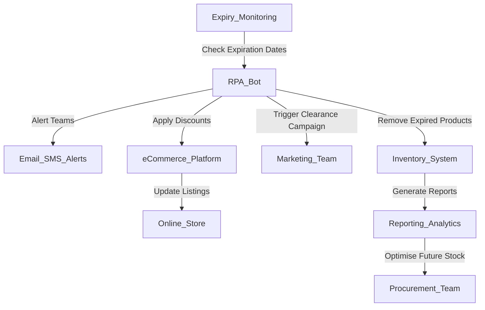

**Industry**: eCommerce  
**Location**: Australia  
**Solution**: Automated Expiring Product Management  
**Tools**: Python, RPA (UiPath), CRM/Inventory Management System, Email/SMS Alerts, eCommerce Platform Integration (Shopify, WooCommerce)

---

### Introduction

Managing expiring products in an online store is critical for retailers, particularly those selling perishables like food, supplements, or cosmetics. If not managed effectively, products may expire unnoticed, leading to waste, lost revenue, and potential damage to customer trust. 

In this case study, we explore how an Australian eCommerce business automated the management of expiring products, ensuring timely promotions, stock clearance, and seamless inventory updates to minimise waste and maximise sales.

---

### Problem

The business faced several challenges in managing expiring products:

- **Manual tracking of expiration dates**: Staff had to manually monitor product expiry dates, which was time-consuming and error-prone. Items were often forgotten, leading to stock remaining unsold past their expiry.
- **Product wastage**: Due to missed expiration dates, the company frequently had to discard products, leading to significant financial losses.
- **Inefficient clearance sales**: Clearance sales were often delayed, as identifying products nearing expiration was a slow, manual process.
- **Inconsistent customer experience**: There were instances where expired or nearly expired products were shipped to customers, negatively impacting customer satisfaction and brand trust.
- **Scaling issues**: As the business grew, the number of products and the complexity of expiration date management increased, making it impossible to manage manually without errors.

The company needed a solution that could automatically track product expiration dates, trigger clearance actions, and update their eCommerce platform efficiently.

---

### Solution: Automated Expiring Product Management

The business implemented an **automated expiring product management system** using **Robotic Process Automation (RPA)**. This system automatically monitored product expiration dates, triggered alerts, updated stock, and initiated promotional activities on the eCommerce platform to ensure that expiring products were sold before they went to waste.

#### Process Overview

Here’s a breakdown of the automated expiring product management process:

1. **Expiration Date Monitoring (Inventory System)**: The RPA bot regularly checks the inventory management system for products with upcoming expiration dates.
2. **Alert Generation**: When a product is nearing its expiration date (e.g., within 30, 15, or 7 days), the bot sends automated **email or SMS alerts** to the inventory and marketing teams, notifying them of the expiring products.
3. **Automated Discount and Promotions**: The bot automatically updates product listings on the eCommerce platform (e.g., **Shopify** or **WooCommerce**) by applying discounts or special offers to encourage faster sales of expiring items.
4. **Inventory Adjustment**: As products reach the end of their shelf life, the system automatically removes them from the online store to prevent accidental sales of expired goods. These items are flagged for disposal or donation, depending on company policy.
5. **Clearance Campaigns**: For products approaching expiration in bulk, the bot initiates clearance campaigns (via email marketing or SMS) targeting customers with specific promotions, encouraging them to purchase the soon-to-expire stock at discounted rates.
6. **Reporting and Analytics**: The system generates reports detailing expiring products, sales velocity, and disposal rates, helping the business optimise future purchasing decisions and reduce overstocking of perishable goods.

#### Process Diagram

Below is a visual representation of the automated expiring product management process:



### Sample Code

Here’s a simplified Python code snippet that demonstrates how the system tracks expiring products, sends alerts, and applies discounts to products nearing expiration.

#### Expiration Date Monitoring and Alerts

```python
import smtplib
import datetime
from email.mime.text import MIMEText

# Step 1: Monitor product expiration dates
def check_expiring_products(products):
    expiring_soon = []
    today = datetime.date.today()
    for product in products:
        expiry_date = datetime.datetime.strptime(product['expiry_date'], '%Y-%m-%d').date()
        if (expiry_date - today).days <= 30:  # Check if expiry is within 30 days
            expiring_soon.append(product)
    return expiring_soon

# Step 2: Send alert for expiring products
def send_expiry_alert(product, team_email):
    msg = MIMEText(f"Product {product['name']} is expiring soon on {product['expiry_date']}. Please take action.")
    msg['Subject'] = f"Expiring Product Alert: {product['name']}"
    msg['From'] = 'inventory@store.com'
    msg['To'] = team_email

    with smtplib.SMTP('smtp.mailserver.com') as server:
        server.login('username', 'password')
        server.send_message(msg)
    print(f"Alert sent for product: {product['name']}")

# Example usage
products = [
    {'name': 'Protein Powder', 'expiry_date': '2024-10-15'},
    {'name': 'Vitamins', 'expiry_date': '2024-09-20'}
]

expiring_soon_products = check_expiring_products(products)
for product in expiring_soon_products:
    send_expiry_alert(product, 'procurement@store.com')
```

#### Applying Discounts on Expiring Products (eCommerce Integration)

```python
import requests

# Step 3: Apply discount to expiring products on the eCommerce platform
def apply_discount_to_expiring_product(product, discount_percentage):
    api_url = f"https://yourstore.myshopify.com/admin/api/2023-01/products/{product['id']}.json"
    headers = {'Content-Type': 'application/json', 'X-Shopify-Access-Token': 'YOUR_SHOPIFY_API_TOKEN'}
    
    product_update_payload = {
        "product": {
            "id": product['id'],
            "variants": [{
                "price": round(product['price'] * (1 - discount_percentage / 100), 2)
            }]
        }
    }
    
    response = requests.put(api_url, json=product_update_payload, headers=headers)
    
    if response.status_code == 200:
        print(f"Discount applied to {product['name']} - New Price: ${product_update_payload['product']['variants'][0]['price']}")
    else:
        print(f"Failed to update {product['name']} - Error: {response.text}")

# Example usage
for product in expiring_soon_products:
    apply_discount_to_expiring_product(product, 20)  # Apply 20% discount
```

This script monitors expiring products, alerts the relevant team members, and applies discounts to those products in the eCommerce platform to encourage quicker sales.

### Benefits Derived

The automated expiring product management system provided several key benefits to the business:

1. **Reduced Waste**: The system significantly reduced product wastage by ensuring that expiring products were either sold at a discount or removed from the store before they could expire.
2. **Increased Sales of Near-Expiry Products**: Automated discounting and clearance campaigns led to an increase in sales of near-expiry products, helping the company recover revenue that would have otherwise been lost.
3. **Improved Inventory Control**: Real-time alerts and inventory updates allowed the business to maintain better control over stock, ensuring that no expired products were accidentally sold to customers.
4. **Enhanced Customer Trust**: By preventing the sale of expired products and offering discounted deals on products nearing expiration, the business improved its reputation and customer satisfaction.
5. **Scalability**: The automated system easily handled a growing inventory and increasing product lines, making it an ideal solution for an expanding eCommerce business.

---

### Conclusion

By automating the management of expiring products, the Australian online store was able to reduce waste, increase sales, and improve inventory control. The system ensured that expiring products were either sold quickly or removed from stock, minimising the risk of waste and maximising revenue opportunities.

For eCommerce businesses that deal with perishable or date-sensitive products, automating expiring product management can significantly improve operational efficiency, reduce losses, and enhance customer satisfaction.

---

This case study demonstrates the value of automating expiring product management in eCommerce. By implementing an automated system, businesses can streamline their operations, reduce manual errors, and ensure that they are maximising revenue from every product in their inventory.