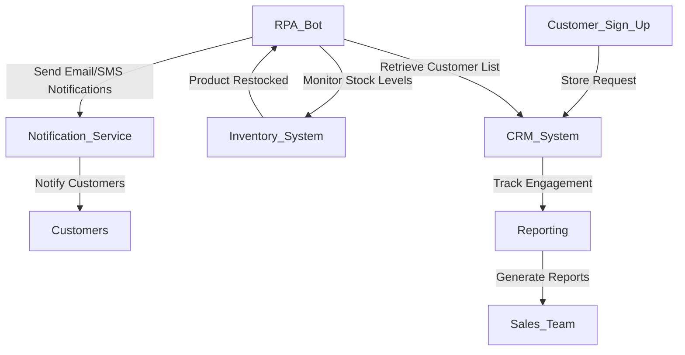

**Industry**: eCommerce  
**Location**: Australia  
**Solution**: Automated Back-in-Stock Notifications  
**Tools**: Python, RPA (UiPath), CRM Integration, Email/SMS Alerts, eCommerce Platform Integration (Shopify, WooCommerce)

---

### Introduction

For eCommerce businesses, notifying customers when out-of-stock products are back in stock is crucial to retaining customer interest and boosting sales. Many potential customers abandon their purchase when a product is unavailable, and if not notified when the item is restocked, these customers may shop elsewhere. Automating back-in-stock notifications can capture these sales opportunities, keep customers engaged, and improve customer satisfaction.

In this case study, we explore how an Australian eCommerce company automated the process of sending back-in-stock notifications via email and SMS, resulting in improved sales conversion and customer retention.

---

### Problem

The business was facing several challenges with managing out-of-stock products and notifying customers when items were restocked:

- **Missed sales opportunities**: Customers often expressed interest in out-of-stock products, but manual follow-ups were inconsistent, leading to missed sales.
- **Manual notification process**: Staff had to manually track stock levels and send individual notifications when items were back in stock, which was time-consuming and prone to delays.
- **Customer frustration**: Without timely notifications, customers were often frustrated when they missed the chance to purchase restocked items.
- **Difficulty managing scale**: As the company grew, the number of products and customers increased, making it difficult to manually track and notify customers about restocked items in a timely manner.

To address these issues, the company needed an automated solution that would track product stock levels and send real-time notifications to customers when items were back in stock.

---

### Solution: Automated Back-in-Stock Notifications

The company implemented an **automated back-in-stock notification system** using **Robotic Process Automation (RPA)** to monitor product availability and trigger real-time notifications when stock levels were replenished. Customers who had signed up for updates were instantly notified via **email or SMS**, allowing them to make a purchase as soon as the product became available again.

#### Process Overview

Here’s a breakdown of the automated back-in-stock notification process:

1. **Customer Sign-Up for Notifications (eCommerce Platform)**: When a product is out of stock, customers can sign up to be notified when it becomes available. This information is stored in the company’s **CRM system**.
2. **Inventory Monitoring (RPA)**: The RPA bot continuously monitors the company’s **inventory management system (IMS)** and checks stock levels for products that have customer sign-ups for back-in-stock notifications.
3. **Stock Level Updates**: When the bot detects that a product’s stock level has been replenished, it retrieves the list of customers who signed up for notifications.
4. **Automated Notifications**: The bot sends an **email** or **SMS** notification to the customers, informing them that the product is back in stock. The notification includes a link to the product page, encouraging customers to complete their purchase.
5. **CRM Integration and Follow-Up**: The bot updates the CRM system with details of the notification and tracks customer interactions, such as clicks on the product link or purchases made.
6. **Real-Time Reporting**: The system generates reports showing the number of notifications sent, customer engagement (clicks and conversions), and the performance of restocked products.

#### Process Diagram

Below is a visual representation of the automated back-in-stock notification process:



### Sample Code

Here’s a simplified Python code snippet that demonstrates how the system tracks stock levels, retrieves customer sign-ups, and sends back-in-stock notifications via **email** and **SMS**.

#### Monitoring Stock Levels and Sending Email Notifications (SendGrid)

```python
import requests
import smtplib
from email.mime.text import MIMEText

# Step 1: Monitor stock levels (sample check for a specific product)
def check_stock_levels(product_id):
    inventory_api_url = f'https://ecommerce.com/api/products/{product_id}/inventory'
    response = requests.get(inventory_api_url)
    product_data = response.json()
    return product_data['stock'] > 0  # Check if stock is available

# Step 2: Send email notification
def send_back_in_stock_email(customer_email, product_name, product_url):
    msg = MIMEText(f"The product '{product_name}' is back in stock! Purchase now: {product_url}")
    msg['Subject'] = f"Back in Stock: {product_name}"
    msg['From'] = 'notifications@store.com'
    msg['To'] = customer_email
    
    with smtplib.SMTP('smtp.mailserver.com') as server:
        server.login('username', 'password')
        server.send_message(msg)
    print(f"Back-in-stock email sent to {customer_email}")

# Example usage
product_id = 12345
if check_stock_levels(product_id):
    # Retrieve customer emails from CRM (dummy list for example)
    customers_to_notify = ['customer1@example.com', 'customer2@example.com']
    for customer_email in customers_to_notify:
        send_back_in_stock_email(customer_email, 'Product ABC', 'https://ecommerce.com/product/abc')
```

#### Sending SMS Notifications (Twilio)

```python
from twilio.rest import Client

# Step 3: Send SMS notification
def send_back_in_stock_sms(customer_phone, product_name, product_url):
    client = Client("YOUR_TWILIO_ACCOUNT_SID", "YOUR_TWILIO_AUTH_TOKEN")
    
    message = client.messages.create(
        body=f"The product '{product_name}' is back in stock! Buy now: {product_url}",
        from_='+1234567890',  # Your Twilio phone number
        to=customer_phone
    )
    print(f"Back-in-stock SMS sent to {customer_phone}")

# Example usage
customers_to_notify = ['+61412345678', '+61498765432']
for customer_phone in customers_to_notify:
    send_back_in_stock_sms(customer_phone, 'Product ABC', 'https://ecommerce.com/product/abc')
```

This script monitors stock levels for a product and automatically sends email or SMS notifications to customers who signed up to be notified when the product is back in stock.

### Benefits Derived

The automated back-in-stock notification system provided several key benefits to the company:

1. **Increased Sales**: Automating notifications resulted in a higher conversion rate for restocked products, as customers were immediately informed when items they wanted became available.
2. **Improved Customer Retention**: Customers appreciated being notified when out-of-stock items were back in stock, leading to improved loyalty and repeat purchases.
3. **Time Savings**: The automation eliminated the need for staff to manually monitor stock levels and send notifications, freeing up resources for other business activities.
4. **Reduced Missed Opportunities**: With real-time notifications, customers could act quickly, reducing the likelihood of losing sales to competitors or missing out on restocked items.
5. **Scalability**: As the company’s inventory and customer base grew, the system effortlessly scaled to handle larger volumes of products and notifications without any additional manual effort.

---

### Conclusion

By automating back-in-stock notifications, the Australian eCommerce company was able to engage customers more effectively, capture missed sales opportunities, and improve overall operational efficiency. The system provided a seamless way to inform customers when their desired products became available, driving higher sales and customer satisfaction.

For eCommerce businesses, implementing automated back-in-stock notifications is a simple yet powerful way to boost conversions, retain customers, and improve the shopping experience.

---

This case study demonstrates the value of automation in customer engagement. By automating back-in-stock notifications, businesses can increase sales, improve customer retention, and streamline their operations, ensuring that customers are always kept in the loop when their desired products are restocked.