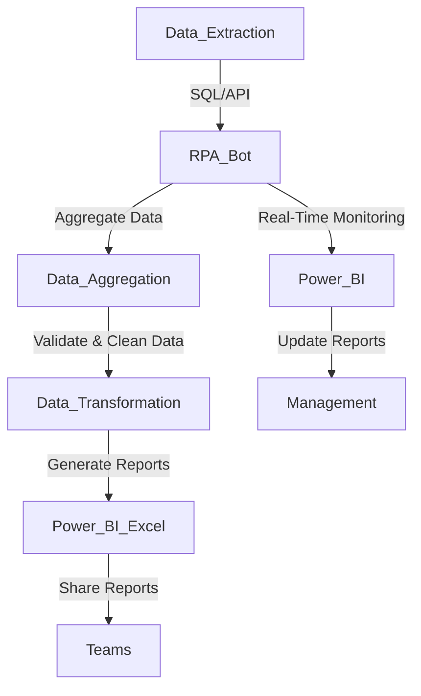

**Industry**: Retail  
**Location**: Australia  
**Solution**: Automated Stock-on-Hand Reporting  
**Tools**: Python, RPA (UiPath), Inventory Management System (IMS), SQL, Excel, Power BI

---

### Introduction

Maintaining accurate and up-to-date stock-on-hand data is critical for retailers. Stock-on-hand reports provide vital insights into inventory levels, helping businesses ensure they have the right products available when needed while avoiding overstocking. However, manually generating these reports is time-consuming and often prone to errors, especially for businesses managing large inventories across multiple locations.

In this case study, we explore how an Australian retailer automated its stock-on-hand reporting process, improving data accuracy, report generation speed, and decision-making capabilities.

---

### Problem

The retailer faced several challenges in its stock-on-hand reporting process:

- **Manual data collection**: Staff had to manually pull data from different systems, including the inventory management system (IMS), sales data, and warehouse reports, to compile stock-on-hand reports.
- **Time-consuming reporting**: Generating weekly and monthly stock-on-hand reports was time-consuming and often required several hours or even days of work.
- **Data inaccuracies**: Manually compiled reports were prone to data entry errors, leading to inaccurate stock counts that caused issues such as stockouts, overstocking, and discrepancies in supply chain decisions.
- **Delayed decision-making**: Delays in generating reports meant that management often had outdated information, leading to reactive rather than proactive decisions about purchasing and stock allocation.
- **Difficulty in scaling**: As the retailer’s product range expanded and it opened new stores and warehouses, the process became more complex and harder to manage manually.

The company needed an automated solution to generate real-time stock-on-hand reports, providing accurate inventory insights across multiple locations without the need for manual intervention.

---

### Solution: Automated Stock-on-Hand Reporting

The retailer implemented an **automated stock-on-hand reporting system** using **Robotic Process Automation (RPA)** and data integration with the **Inventory Management System (IMS)** and **Power BI** for real-time reporting. This solution allowed the company to monitor stock levels across all stores and warehouses and generate comprehensive reports instantly.

#### Process Overview

Here’s how the automated stock-on-hand reporting process worked:

1. **Data Extraction from IMS**: The RPA bot regularly extracts real-time stock data from the retailer’s IMS using **SQL queries** and **API integrations**.
2. **Data Aggregation**: The bot aggregates data from various sources, including warehouse stock levels, sales data, and purchase orders, to ensure that stock-on-hand reports reflect the most accurate information possible.
3. **Data Validation and Transformation**: The bot checks for inconsistencies or missing data, cleans the extracted data, and transforms it into a standard format for reporting.
4. **Report Generation (Excel/Power BI)**: The cleaned and validated data is fed into **Power BI** or **Excel** to generate visual stock-on-hand reports. These reports include critical metrics such as current stock levels, product turnover rates, and replenishment needs.
5. **Automated Report Distribution**: The reports are automatically distributed to relevant teams (procurement, warehouse, and management) via email or shared dashboards.
6. **Real-Time Monitoring**: The system continuously monitors stock levels and automatically updates the stock-on-hand reports in **Power BI**, providing real-time insights to decision-makers.

#### Process Diagram

Below is a visual representation of the automated stock-on-hand reporting process:



### Sample Code

Here’s a simplified Python code snippet that demonstrates how the bot extracts data from the IMS, processes it, and generates stock-on-hand reports in Excel or Power BI.

#### Data Extraction from IMS (SQL)

```python
import pyodbc
import pandas as pd

# Step 1: Connect to the Inventory Management System (IMS) and retrieve stock data
def fetch_stock_data():
    conn = pyodbc.connect('DRIVER={SQL Server};SERVER=server_name;DATABASE=inventory_db;UID=user;PWD=password')
    query = """
    SELECT product_id, product_name, location, stock_on_hand
    FROM inventory
    WHERE stock_on_hand >= 0
    """
    stock_data = pd.read_sql(query, conn)
    conn.close()
    return stock_data

# Fetch stock data from IMS
stock_data = fetch_stock_data()
print(stock_data.head())  # Display a sample of the data
```

#### Data Processing and Report Generation (Excel)

```python
import pandas as pd

# Step 2: Clean and process the data
def process_stock_data(stock_data):
    stock_data['location'] = stock_data['location'].str.upper()  # Normalize location names
    stock_data['stock_on_hand'] = stock_data['stock_on_hand'].astype(int)  # Ensure stock values are integers
    return stock_data

# Step 3: Generate an Excel report
def generate_excel_report(stock_data):
    report_filename = 'stock_on_hand_report.xlsx'
    stock_data.to_excel(report_filename, index=False)
    print(f"Stock-on-hand report generated: {report_filename}")

# Process the data and generate the report
processed_data = process_stock_data(stock_data)
generate_excel_report(processed_data)
```

#### Real-Time Reporting with Power BI

For real-time reporting, the bot can integrate with **Power BI** using APIs or a direct connection, allowing real-time updates to stock-on-hand dashboards.

### Benefits Derived

The automated stock-on-hand reporting system provided several key benefits to the retailer:

1. **Real-Time Insights**: The automated system provided real-time stock visibility across all stores and warehouses, allowing management to make data-driven decisions.
2. **Time Savings**: By automating data collection, validation, and reporting, the system significantly reduced the time spent on manual report generation, freeing up staff for more strategic tasks.
3. **Increased Accuracy**: The elimination of manual data entry and validation errors resulted in more accurate stock reports, leading to better purchasing decisions and fewer stockouts or overstocking issues.
4. **Improved Inventory Management**: The system provided clear insights into stock levels, helping the retailer avoid stockouts, identify slow-moving inventory, and optimise replenishment strategies.
5. **Scalability**: As the retailer expanded to new locations and increased its product range, the automated system scaled effortlessly, continuing to deliver accurate reports without additional resources.

---

### Conclusion

By automating stock-on-hand reporting, the Australian retailer was able to gain real-time insights into inventory levels, improve decision-making, and reduce the manual effort involved in generating reports. The automated solution provided increased accuracy, faster reporting, and the ability to scale with the company’s growing inventory and locations.

For retailers seeking to improve inventory management and decision-making, automating stock-on-hand reporting is an effective solution that ensures accurate data, reduces operational costs, and provides actionable insights in real-time.

---

This case study highlights the benefits of automating stock-on-hand reporting. By implementing an automated system, businesses can improve inventory accuracy, reduce manual workloads, and gain the real-time visibility needed to optimise their supply chain and ensure the right products are available at the right time.