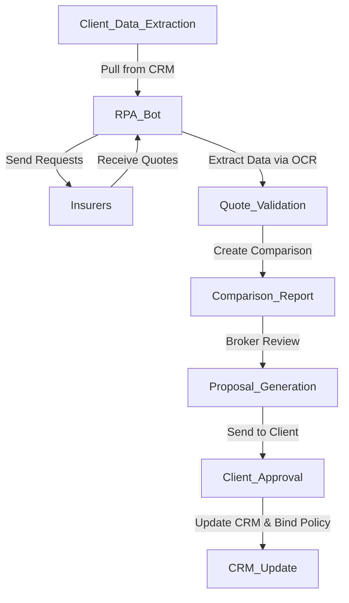

**Industry**: Insurance Broking  
**Location**: Australia  
**Solution**: Automated Re-broking of Policies  
**Tools**: Python, RPA (UiPath), OCR, CRM Integration (Salesforce)

---

### Introduction

Insurance brokers play a vital role in finding the best policies for their clients, often needing to re-broke policies when contracts come up for renewal. This process, known as re-broking, involves gathering quotes from multiple insurers, comparing options, and securing the best deal. However, the traditional approach is labour-intensive, involving a lot of manual data entry and communication with insurers.

In this case study, we explore how an Australian insurance brokerage firm automated the re-broking process to save time, reduce errors, and improve the overall client experience.

---

### Problem

The brokerage firm was facing a number of challenges in their manual re-broking process:

- **Labour-intensive**: Re-broking involved multiple steps, including manually retrieving client data, sending quote requests to insurers, and entering policy details into their CRM.
- **Slow turnaround**: It often took days to gather quotes, compare them, and get back to the client, which delayed the renewal process.
- **Risk of human error**: Manually entering client and policy information into multiple systems resulted in data inconsistencies, leading to incorrect quotes and potential compliance risks.
- **Scaling issues**: As the client base grew, the brokerage found it increasingly difficult to manage the growing number of re-broking requests.

They needed a more efficient, scalable solution that would allow them to re-broke policies quickly and accurately, while also maintaining compliance with industry regulations.

---

### Solution: Automated Re-broking of Policies

The company implemented an **automated re-broking solution** using **Robotic Process Automation (RPA)** to manage the entire process, from data extraction to policy comparison. By integrating RPA with their **CRM system (Salesforce)**, the brokerage was able to automate repetitive tasks and streamline the re-broking workflow.

#### Process Overview

Here’s a breakdown of the automated re-broking process:

1. **Client Data Extraction (CRM)**: The RPA bot pulls client and policy data from Salesforce, identifying which policies are due for renewal and require re-broking.
2. **Quote Requests**: The bot sends automated quote requests to insurers based on the client’s policy requirements.
3. **Insurer Response Handling (OCR)**: Responses from insurers, often in PDF or email format, are captured by the bot using **OCR (Optical Character Recognition)** technology to extract key information such as premium amounts, coverage limits, and terms.
4. **Data Validation**: The bot validates the received quotes to ensure completeness and correctness before entering them into the system.
5. **Comparison and Analysis**: The bot compiles the quotes into a single comparison report, allowing brokers to easily evaluate the best options.
6. **Client Proposal Generation**: Once the best policy is selected, the bot generates a proposal document to send to the client for review and approval.
7. **Policy Issuance**: Upon client approval, the bot updates the CRM with the new policy details and sends a confirmation to the insurer to bind the policy.

#### Process Diagram

Here’s a visual representation of the automated re-broking process:



### Sample Code

Here’s a simplified Python code snippet that demonstrates how the bot retrieves client data from the CRM, sends quote requests, and processes the insurer responses using OCR:

```python
import requests
from ocrmypdf import ocr

# Step 1: Retrieve client data from CRM (Salesforce)
def fetch_client_data(client_id):
    response = requests.get(f'https://api.salesforce.com/client/{client_id}')
    if response.status_code == 200:
        return response.json()
    else:
        print(f"Failed to retrieve data for client {client_id}")
        return None

# Step 2: Send quote requests to insurers
def send_quote_requests(client_data):
    insurers = ['InsurerA', 'InsurerB', 'InsurerC']
    for insurer in insurers:
        requests.post(f'https://{insurer}.com/quote', json=client_data)
        print(f"Quote request sent to {insurer}")

# Step 3: Process insurer responses with OCR
def process_insurer_responses(pdf_path):
    ocr_result = ocr(pdf_path, 'output.pdf', force_ocr=True)
    with open('output.pdf', 'r') as processed_pdf:
        # Extract necessary details from the processed OCR result
        for line in processed_pdf:
            if "Premium" in line:
                print(f"Extracted Premium: {line}")
            elif "Coverage" in line:
                print(f"Extracted Coverage: {line}")

# Sample run
client_data = fetch_client_data(12345)
send_quote_requests(client_data)
process_insurer_responses('insurer_response.pdf')
```

This script simulates key steps in the automated re-broking process, from fetching client data from the CRM to processing insurer responses via OCR.

### Benefits Derived

The implementation of automated re-broking provided several key benefits to the insurance brokerage:

1. **Faster Turnaround**: The time to complete the re-broking process was reduced by over 50%, allowing the brokerage to handle a higher volume of policies more efficiently.
2. **Improved Accuracy**: By automating data entry and using OCR to extract information from insurer responses, the risk of human error was significantly reduced.
3. **Increased Scalability**: The brokerage could easily scale its operations to handle more clients without adding additional staff.
4. **Better Client Experience**: Clients received quotes and proposals more quickly, improving overall satisfaction and renewal rates.
5. **Enhanced Compliance**: Automation ensured that the brokerage remained compliant with industry regulations by accurately logging all interactions and policy details in the CRM.

---

### Conclusion

Automating the re-broking process transformed the way this insurance brokerage managed policy renewals. The implementation of RPA and OCR reduced manual effort, improved accuracy, and allowed the brokerage to deliver a faster, more reliable service to its clients. The ability to handle re-broking more efficiently gave the brokerage a competitive edge, allowing it to focus more on strategic client relationships and less on administrative tasks.

For insurance brokers facing growing workloads and the need to streamline operations, automating re-broking processes offers a scalable, error-free solution that improves efficiency and client satisfaction.

---

This case study highlights the value of automation in insurance broking. By adopting RPA and OCR technologies, brokers can save time, reduce errors, and offer faster, more responsive service to clients. For firms handling large volumes of renewals, this solution is a game-changer in improving operational efficiency and maintaining compliance.